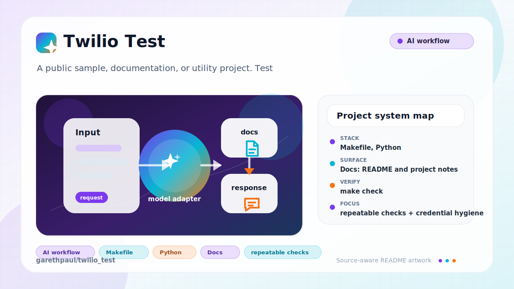

# twilio_test

<!-- README-OVERVIEW-IMAGE -->


## Overview

`garethpaul/twilio_test` is a public sample, documentation, or utility project. Test

This README is based on the checked-in source, manifests, scripts, and repository metadata on the `master` branch. The project language mix found during review was: no dominant source language detected.

## Repository Contents

- `README.md` - project overview and local usage notes
- `.github` - source or example code
- `SECURITY.md` - security reporting and disclosure guidance
- `VISION.md` - project direction and maintenance guardrails

Additional scan context:

- Source directories: .github
- Dependency and build manifests: none detected
- Entry points or build surfaces: none detected
- Test-looking files: no obvious test files detected

## Getting Started

### Prerequisites

- Git

### Setup

```bash
git clone https://github.com/garethpaul/twilio_test.git
cd twilio_test
```

The setup commands above are derived from repository files. Legacy mobile, Python, or JavaScript samples may require older SDKs or package versions than a modern workstation uses by default.

## Running or Using the Project

- No single runtime entry point was identified. Start by reading the source files and manifests listed above.
- Run `make check` to check the placeholder documentation and GitHub workflow contract.
- Copy `.env.example` to `.env` only for local experiments. Keep the placeholder
  values empty until a real mock or sandbox test harness exists.

## Intended Test Scenario

This repository is reserved for a future Twilio integration smoke test. The
first implementation should use mock or sandbox Twilio test doubles, keep live
calls and messages opt-in, and document required environment variables before
adding runtime code. In particular, live calls and messages must remain opt-in.

## Testing and Verification

- `make check`
- GitHub Actions runs the same contracts on Python 3.10, 3.12, and 3.14 with
  read-only repository contents permissions, Ubuntu 24.04, and immutable action
  pins.
- The greeting workflow uses `pull_request_target` without checkout or command
  execution so first-time contributors from forks can receive the static
  greeting with separate event-scoped comment permissions.
- Completed maintenance plans live under `docs/plans` and are checked by
  `make check`.

When the required SDK or runtime is unavailable, use static checks and source review first, then verify on a machine that has the matching platform toolchain.

## Configuration and Secrets

- No required secret or credential file was identified in the repository scan.
  Local `.env` files and debug logs are ignored so future Twilio experiments do
  not casually stage credentials, account identifiers, customer payloads, or
  HTTP archive captures.
- Packet captures, trace files, Wrangler local secrets, PEM files, and key files
  are also ignored. The checker scans every tracked UTF-8 text file for
  real-looking Twilio SIDs, token/phone assignments, and private keys.
- `.env.example` documents expected Twilio variable names with empty values and
  keeps live sends disabled by default, including a placeholder body for future
  message smoke tests and an `info` log-level default. Each placeholder
  includes a short comment describing what may be filled locally and what must
  stay empty in git. Static checks require credential, phone-number, and body
  placeholders to remain empty and reject duplicate or undocumented Twilio
  placeholder entries.

## Security and Privacy Notes

- Review changes touching authentication or token handling; examples from the scan include .github/workflows/greetings.yml.
- Review changes touching network requests, sockets, or service endpoints; examples from the scan include .github/workflows/greetings.yml.
- Keep local Twilio credentials and debug output out of git; `.env` files and
  `*.log`, `*.har`, packet capture, trace, and key files are intentionally
  ignored. Common local OS and IDE metadata files are ignored as well.

## Maintenance Notes

- See `SECURITY.md` for vulnerability reporting and safe research guidance.
- See `VISION.md` for project direction and contribution guardrails.
- See `docs/plans/2026-06-08-twilio-test-baseline.md` for the canonical
  placeholder contract baseline.
- See `docs/plans/2026-06-08-secret-hygiene.md` for local credential and debug
  log ignore coverage.
- See `docs/plans/2026-06-09-env-example-placeholders.md` for safe environment
  template coverage.
- See `docs/plans/2026-06-09-env-body-placeholder.md` for message body
  placeholder coverage.
- See `docs/plans/2026-06-09-env-example-guidance.md` for per-variable
  `.env.example` guidance coverage.
- See `docs/plans/2026-06-09-env-log-level-placeholder.md` for default
  log-level placeholder coverage.
- See `docs/plans/2026-06-09-empty-env-placeholders.md` for empty credential,
  phone-number, and body placeholder coverage.
- See `docs/plans/2026-06-09-env-example-unique-placeholders.md` for exact-once
  environment placeholder coverage.
- See `docs/plans/2026-06-09-har-artifact-ignore.md` for local HAR capture
  ignore coverage.
- See `docs/plans/2026-06-09-local-metadata-ignore.md` for local OS and IDE
  metadata ignore coverage.
- See `docs/plans/2026-06-10-workflow-hardening-and-ci.md` for immutable
  greetings automation and hosted contract verification.
- See `docs/plans/2026-06-10-tracked-secret-scan.md` for tracked-text secret
  pattern and local capture-artifact coverage.

## Contributing

Keep changes small and tied to the project that is already present in this repository. For code changes, document the toolchain used, avoid committing generated dependency directories or local configuration, and update this README when setup or verification steps change.
